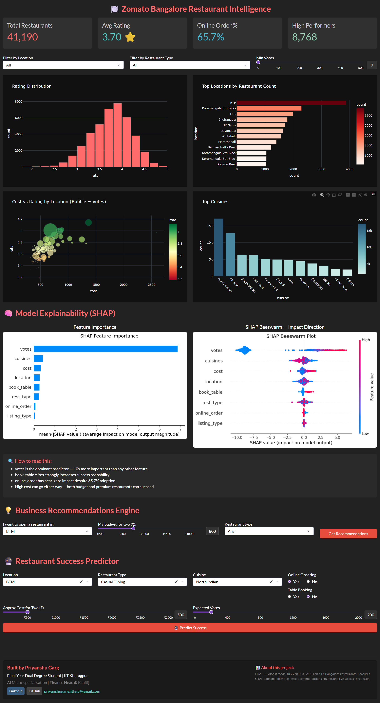
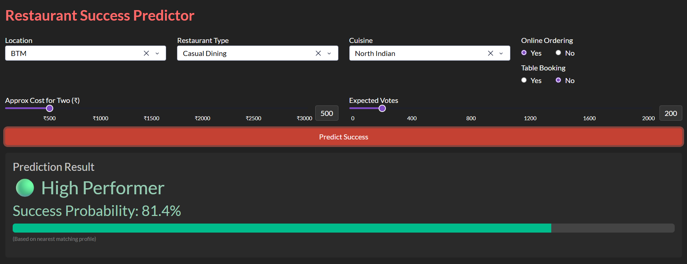

# 🍽️ Zomato Bangalore Restaurant Intelligence

> An end-to-end data science project analyzing 41,190 Bangalore restaurants to predict success, uncover business insights, and guide restaurant strategy — built with XGBoost, SHAP explainability, and deployed as an interactive dashboard.

**[🚀 View Live Dashboard](https://zomato-dashboard-0aqv.onrender.com)** *(may take 30-45s to load on first visit — free tier)*

---

## 📸 Dashboard Preview

---

## 🔑 Key Findings

- **Votes dominate success** — 10x more important than any other feature (SHAP confirmed)
- **Table booking = +0.52 avg rating** — restaurants with reservations consistently outperform
- **Online ordering has near-zero impact** despite 65.7% adoption — volume ≠ quality
- **BTM has 3,873 restaurants** but doesn't appear in top-rated locations — density ≠ quality
- **Lavelle Road leads in avg rating (4.14)** — premium locality effect confirmed
- **Only 21.3% of restaurants qualify as high performers** — significant quality gap

---

## 🧠 Technical Highlights

| Component | Details |
|-----------|---------|
| **Model** | XGBoost Classifier |
| **ROC-AUC** | 0.9978 |
| **Precision** | 0.97 (weighted) |
| **Recall** | 0.99 on high performers |
| **Class Imbalance** | Handled via `scale_pos_weight=3.7` |
| **Explainability** | SHAP TreeExplainer — global + beeswarm plots |
| **Dataset** | 41,190 Bangalore restaurants (post-cleaning) |
| **Deployment** | Plotly Dash + Gunicorn on Render |

---

## 🏗️ Project Structure